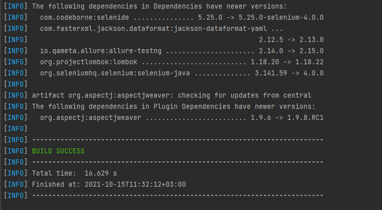
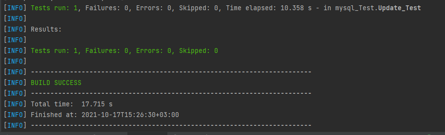
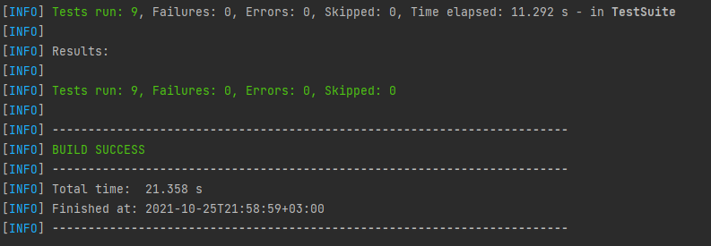

# AutomationProject_Azarova_Lena
## Work with maven
### command to view available library updates:
* mvn versions:display-dependency-updates
### result:

___
### command to run tests:

* mvn -Dtest=Update_Test#updateUser1  test  
(this command only runs the test updateUser1 from Update_Test)

### result:

___
### command to running testng.xml file:

* mvn clean test -Dsuite="src/test/resources/Mysql.xml"
    
  (this command runs Mysql.xml, required configurations are written in pom.xml)
### result:
